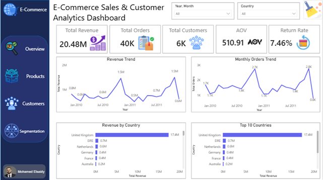
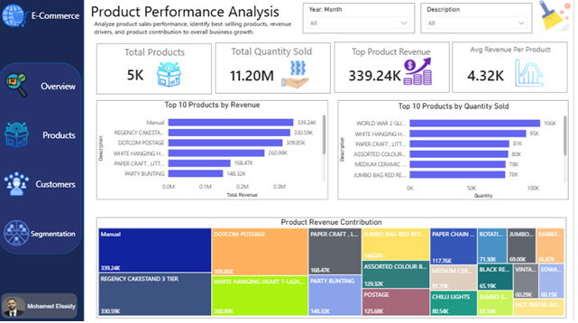
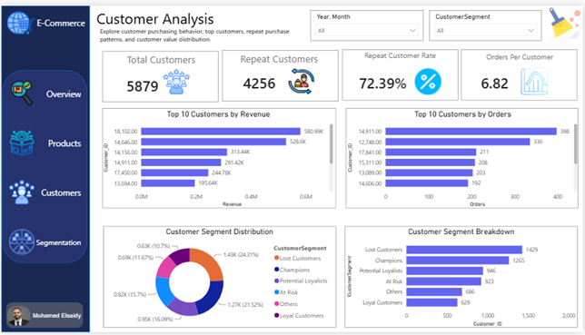
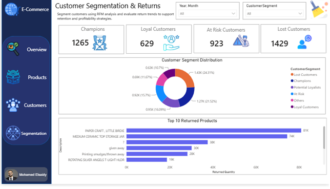

# E-Commerce Sales & Customer Analytics Dashboard

## Project Overview

This project presents a complete end-to-end Data Analytics workflow using SQL Server and Power BI to analyze an E-Commerce retail dataset.

The goal of the project is to transform raw transactional data into actionable business insights by performing data cleaning, exploratory analysis, customer segmentation, and interactive dashboard development.

The project focuses on sales performance, product analysis, customer behavior, customer segmentation (RFM Analysis), and returns analysis.

---
## Dashboard Preview

### Executive Overview



### Product Performance



### Customer Analysis



### Customer Segmentation & Returns



# Project Objectives

The project aims to answer the following business questions:

1. What is the total revenue generated by the business?
2. How many orders and customers does the business have?
3. Which products generate the highest revenue?
4. Which products sell the highest quantities?
5. Which countries contribute the most revenue?
6. Who are the most valuable customers?
7. What is the customer purchasing behavior?
8. What is the return rate?
9. Which products are returned most frequently?
10. How can customers be segmented using RFM Analysis?

---

# Tools Used

- SQL Server
- SQL
- Power BI
- DAX
- GitHub

---

# Dataset Information

Dataset: Online Retail II

The dataset contains transactional records from a UK-based online retailer between:

- December 2009
- December 2011

Key Columns:

- Invoice
- StockCode
- Description
- Quantity
- InvoiceDate
- Price
- Customer_ID
- Country

---

# Data Understanding

Initial data exploration was performed to understand dataset quality and structure.

The following checks were conducted:

- Total Rows
- Unique Customers
- Unique Products
- Unique Invoices
- Missing Customer IDs
- Negative Quantities
- Invalid Prices
- Date Range Analysis

Dataset Period:

- Start Date: 2009-12-01
- End Date: 2011-12-09

---

# Data Cleaning Process

The following cleaning steps were performed:

## 1. Returns Separation

All returned transactions were separated into a dedicated table:

returns_data

Conditions:

- Invoice starts with "C"
- Quantity < 0

---

## 2. Invalid Records Removal

Excluded:

- Negative quantities
- Zero prices
- Negative prices

---

## 3. Duplicate Removal

Duplicate sales records were identified and removed using:

ROW_NUMBER()

---

## 4. Revenue Column Creation

Created a calculated revenue field:

Revenue = Quantity × Price

---

## 5. Clean Sales Table Creation

Created:

sales_clean

This table was used for all business analysis and dashboard development.

---

# Sales KPI Analysis

The following KPIs were calculated:

- Total Revenue
- Total Orders
- Total Customers
- Average Order Value (AOV)
- Orders Per Customer

Results:

| KPI | Value |
|------|------|
| Total Revenue | £20.48M |
| Total Orders | 40K |
| Total Customers | 5.9K |
| Average Order Value | £510.91 |
| Orders Per Customer | 6.29 |

---

# Product Analysis

Product performance was analyzed to identify:

- Best-selling products
- Revenue-driving products
- Product contribution to sales

Key analyses:

## Top Products by Revenue

Examples:

- REGENCY CAKESTAND 3 TIER
- DOTCOM POSTAGE
- WHITE HANGING HEART T-LIGHT HOLDER

## Top Products by Quantity Sold

Examples:

- WORLD WAR 2 GLIDERS ASSTD DESIGNS
- WHITE HANGING HEART T-LIGHT HOLDER
- PAPER CRAFT, LITTLE BIRDIE

Key Insight:

Products generating the highest revenue are not always the products selling the highest quantities.

---

# Customer Analysis

Customer behavior analysis included:

- Top Customers by Revenue
- Top Customers by Orders
- Repeat Customers
- One-Time Customers
- Orders Per Customer

Key Findings:

- Repeat Customers: 4,255+
- One-Time Customers: 1,623
- Repeat Customer Rate: 72%

Top Revenue Customers:

- Customer 18102
- Customer 14646
- Customer 14156
- Customer 14911

---

# Country Analysis

Revenue distribution was analyzed across countries.

Top Countries by Revenue:

1. United Kingdom
2. EIRE
3. Netherlands
4. Germany
5. France

Key Finding:

The United Kingdom contributes the vast majority of total revenue.

---

# RFM Customer Segmentation

RFM Analysis was performed using:

## Recency

Days since customer's last purchase.

## Frequency

Number of orders.

## Monetary

Total customer spending.

Customers were scored using:

- R Score (1–5)
- F Score (1–5)
- M Score (1–5)

---

## Customer Segments

| Segment | Customers |
|----------|----------|
| Lost Customers | 1429 |
| Champions | 1265 |
| Potential Loyalists | 946 |
| At Risk | 923 |
| Others | 686 |
| Loyal Customers | 629 |

---

# Customer Segmentation Insights

## Champions

High-value customers with recent purchases.

Action:

- Loyalty rewards
- VIP offers

---

## Loyal Customers

Frequent repeat buyers.

Action:

- Membership programs
- Cross-selling campaigns

---

## Potential Loyalists

Customers showing positive engagement.

Action:

- Nurture campaigns
- Promotional offers

---

## At Risk Customers

Customers who have not purchased recently.

Action:

- Re-engagement campaigns

---

## Lost Customers

Customers with low recency and engagement.

Action:

- Win-back campaigns

---

# Returns Analysis

Returns were analyzed separately.

Results:

| Metric | Value |
|----------|----------|
| Returned Transactions | 22,951 |
| Returned Value | £1.53M |
| Return Rate | 7.46% |

---

# Returns Insights

Key Findings:

- Returns account for approximately 7.5% of total revenue.
- Certain products experience significantly higher return volumes.
- Returns should be monitored to improve profitability.

---

# Power BI Dashboard

The dashboard consists of four interactive pages.

---

## Page 1 — Executive Overview

Displays:

- Total Revenue
- Orders
- Customers
- AOV
- Return Rate
- Revenue Trend
- Monthly Orders Trend
- Revenue by Country

---

## Page 2 — Product Performance Analysis

Displays:

- Total Products
- Total Quantity Sold
- Top Product Revenue
- Average Revenue Per Product
- Top Products by Revenue
- Top Products by Quantity
- Product Revenue Contribution

---

## Page 3 — Customer Analysis

Displays:

- Repeat Customers
- Repeat Customer Rate
- One-Time Customers
- Orders Per Customer
- Top Customers by Revenue
- Top Customers by Orders
- Customer Segment Distribution
- Customer Segment Breakdown

---

## Page 4 — Customer Segmentation & Returns Analysis

Displays:

- Champions
- Loyal Customers
- At Risk Customers
- Lost Customers
- Customer Segment Distribution
- Top Returned Products

---

# Business Recommendations

## Customer Retention

Focus retention efforts on:

- At Risk Customers
- Lost Customers

through personalized marketing campaigns.

---

## Loyalty Programs

Reward:

- Champions
- Loyal Customers

to maximize lifetime value.

---

## Product Strategy

Increase inventory availability for:

- High-revenue products
- High-demand products

---

## Returns Management

Investigate products with:

- High return quantities
- High return values

to reduce revenue leakage.

---

## Geographic Expansion

Expand marketing efforts in:

- United Kingdom
- EIRE
- Netherlands

to maximize growth opportunities.

---

# Project Structure

```text
Ecommerce-Sales-Analytics
│
├── SQL
│   ├── 01_Data_Understanding.sql
│   ├── 02_Data_Cleaning.sql
│   ├── 03_Sales_KPIs.sql
│   ├── 04_Product_Analysis.sql
│   ├── 05_Customer_Analysis.sql
│   ├── 06_Country_Analysis.sql
│   ├── 07_RFM_Analysis.sql
│   └── 08_Returns_Analysis.sql
│
├── PowerBI
│   └── Ecommerce_Sales_Analytics.pbix
│
├── Dataset
│   └── Online_Retail_II.xlsx
│
├── Screenshots
│   ├── 01_Executive_Overview.png
│   ├── 02_Product_Performance.png
│   ├── 03_Customer_Analysis.png
│   └── 04_Customer_Segmentation_Returns.png
│
└── README.md
```

---

# Author

Mohamed Elsaidy

Data Analyst Portfolio Project

SQL Server | Power BI | Data Analytics | Business Intelligence
